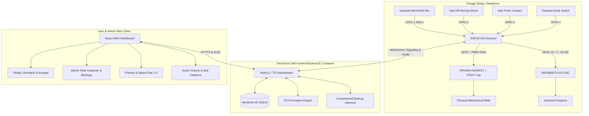

# DecaTone

<div align="center">
  
  
  <h3>Vintage Rotary Telephone VoIP Switch & IoT Control System</h3>

  [](LICENSE)
  [](https://hub.docker.com/repository/docker/tylerhats/decatone/general)
  [](https://www.espressif.com/)
  [](https://nodejs.org/)
  [](https://reactjs.org/)
</div>

---

## ☎️ Overview

**DecaTone** is an open-source telephone switch and VoIP hardware system that revives vintage rotary telephones. By replacing the antique telephone's internal central-office control circuitry with a **Hosyond ESP32-S3** microcontroller, DecaTone brings authentic rotary dialing, physical mechanical bell ringing, and encrypted voice calls into the modern internet era with a self-hosted cloud switchboard and a rich, retro-futuristic web dashboard.

---

## 🌟 Key Features

- **Antique Telephone Revival**:
  - **Rotary Pulse Decoding**: High-precision interrupt-driven pulse counter converts 1–10 mechanical pulses into digital numbers (1–9, 0).
  - **Physical Mechanical Bell Ringer**: Drives the internal twin gongs via an **IRF640N MOSFET** at 20Hz AC resonance with customizable cadences (Traditional US, European Double-Ring, Pulsed, Rapid).
  - **HD Digital Audio**: **MAX98357A I2S Mono DAC/Amp** for handset earpiece audio + **MAX4466 Electret Pre-Amp** connected to ADC1 for clear, noise-free voice streaming.
  - **Hook Switch Detection**: Detects handset cradle lifting and replacement with authentic zero-latency dial tone synthesis (350Hz + 440Hz).
- **Modern Self-Hosted Switchboard**:
  - **Single-Container Deployment**: Built as a self-contained Docker image backed by SQLite (WAL mode).
  - **Encrypted Voice Streaming**: Low-latency bidirectional audio frames routed over secure WebSockets with end-to-end encryption.
  - **Interactive Voicemail Studio**: Record/upload custom voicemail greetings, listen to voicemails in the browser, or pick up the physical handset and dial `0` to listen to messages.
  - **Rotary Speed Dial**: Assign favorite contacts to rotary digits **1 through 9** for instantaneous single-digit dialing.
  - **Friend System & Call Privacy**: Send/accept friend requests, or enforce "Friends Only" / "Do Not Disturb" call filters.
  - **Comprehensive Admin Suite**: Fleet hardware inspector with live ping & remote test ring, compressed `.tar.gz` backups, release channel self-updater (`stable`, `beta`, `alpha`), OTA firmware updater, and whitelabeling.

---

## 🏛️ System Architecture



---

## 🔌 Hardware Pinout (Hosyond ESP32-S3)

| Pin | Function | Peripheral / Connection |
| :--- | :--- | :--- |
| **GPIO 1** | ADC1_CH0 | **MAX4466** Analog Microphone Output |
| **GPIO 4** | Input Pullup | **Handset Hook Switch** (Connects to GND when lifted) |
| **GPIO 5** | Input Pullup | **Rotary Dial Pulse Switch** (Pulses to GND on return) |
| **GPIO 6** | Input Pullup | **Rotary Dial Off-Normal Switch** (Grounded while rotating) |
| **GPIO 7** | Output PWM | **IRF640N MOSFET Gate** (20Hz AC Bell Ringing) |
| **GPIO 16** | Output | **MAX98357A I2S BCLK** (Bit Clock) |
| **GPIO 17** | Output | **MAX98357A I2S LRCK** (Word Select / WS) |
| **GPIO 18** | Output | **MAX98357A I2S DOUT** (Serial Audio Data Out) |
| **GPIO 48** | Output | **Built-in WS2812 RGB Status LED** |
| **GPIO 0** | Input | **Boot Button** (Hold 5s on boot for Setup AP) |

👉 **[View Detailed Electrical Schematics & Circuit Diagrams](docs/schematics/schematic_diagrams.md)**

---

## 🚀 Quick Start (Docker Compose)

### 1. Run DecaTone Container
```bash
# Clone the repository
git clone https://github.com/TylerHats/DecaTone.git
cd DecaTone

# Start via Docker Compose
docker compose up -d
```

### 2. Initial Setup Wizard
1. Open your browser to `http://localhost:4000`.
2. Follow the setup wizard to create the initial Administrator account.

---

## 🛠️ Flashing ESP32-S3 Firmware

### Using PlatformIO
```bash
cd firmware
pio run --target upload
```

### Captive Portal Provisioning
1. On first boot, connect to WiFi AP **`DecaTone-Setup-XXXX`**.
2. Browse to `http://192.168.4.1`.
3. Select your home WiFi, enter the server base URL (e.g. `https://phone.example.com`), copy your **Unique Device ID**, and click **Save**.
4. Log into the DecaTone web portal, enter your Device ID, and test your physical bell ringer!

---

## 📚 Documentation & Wiki

- **[Hardware Wiring & Schematics](wiki/Hardware-Wiring-and-Pinouts.md)**
- **[Firmware Flashing & Provisioning Guide](wiki/Firmware-Flashing-and-Setup.md)**
- **[Backend & Reverse Proxy Deployment](wiki/Backend-and-Docker-Deployment.md)**
- **[Phone Numbering, Routing & Speed Dial](wiki/Phone-Numbering-and-Routing.md)**
- **[Audio & Bell Ringer Tuning](wiki/Audio-and-Bell-Ringer-Tuning.md)**
- **[User & Admin Operations Guide](wiki/User-and-Admin-Guide.md)**
- **[Troubleshooting & FAQ](wiki/Troubleshooting-and-FAQ.md)**

---

## 📄 License

DecaTone is open-source software licensed under the [GNU General Public License v3.0](LICENSE).
