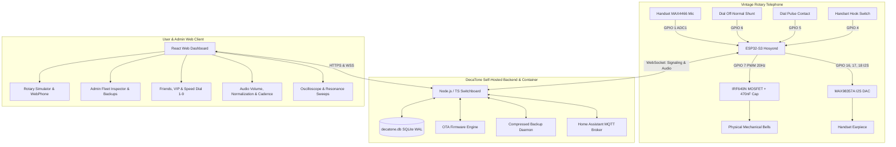

# DecaTone

<div align="center">
  
  
  <h3>Vintage Rotary Telephone VoIP Switch & IoT Control System</h3>

  [](LICENSE)
  [](https://hub.docker.com/repository/docker/tylerhats/decatone/general)
  [](https://www.espressif.com/)
  [](https://nodejs.org/)
  [](https://reactjs.org/)
</div>

---

## ☎️ Overview

**DecaTone** is an open-source, private telephony switch and VoIP hardware system designed to revive vintage rotary telephones (such as the Western Electric 500, Automatic Electric AE40/AE50, Kellogg, and European rotary phones). By replacing the antique telephone's internal central-office circuitry with a **Hosyond ESP32-S3** microcontroller, DecaTone brings authentic rotary pulse dialing, physical mechanical bell ringing, and encrypted voice calls into the modern internet era with a self-hosted cloud switchboard and a rich, retro-futuristic web dashboard.

---

## 🌟 Key Features

### 🔌 Antique Telephone Revival & DSP Audio
- **Rotary Pulse Decoding**: Interrupt-driven pulse counter converts 1–10 mechanical pulses into digital numbers (`1`–`9`, `0`) with live PPS governor timing and break/make ratio diagnostics.
- **Physical Mechanical Bell Ringer**: Drives internal twin gongs via an **IRF640N MOSFET** at authentic AC resonance (15Hz–30Hz configurable, 20Hz default) with customizable cadences (Traditional US, European Double-Ring, Pulsed, Rapid, Custom).
- **HD Digital Audio with Vintage Acoustics**: **MAX98357A I2S Mono DAC/Amp** for handset earpiece audio + **MAX4466 Electret Pre-Amp** connected to ADC1 for crystal-clear voice streaming.
- **Inbound Audio Normalization & Mic AGC**: Real-time RMS leveler automatically normalizes incoming caller volume to a standard -18 dBFS reference with peak limiting, while outbound Automatic Gain Control (AGC) and ambient noise gating standardize microphone transmission levels.
- **Acoustic Vintage Profiles**: Choose between *Vintage POTS (300Hz–3.4kHz Carbon Mic warmth)*, *1930s Early Bell (400Hz–2.5kHz lo-fi non-linear compression)*, or *Modern HD Wideband (16kHz linear)*.
- **Intelligent Power Savings**: Automatic CPU frequency scaling (`80MHz` on-hook idle $\rightarrow$ `240MHz` active telephony) and WiFi modem sleep (`WIFI_PS_MIN_MODEM`) reduce thermal dissipation and standby power consumption.

### 🕹️ Advanced In-Call Dialed Commands & Hook Flash
- **`0`**: Reject incoming call-waiting to voicemail / Connect to interactive voicemail inbox when dialed from idle.
- **`1`**: Accept incoming call-waiting / Intercept live voicemail screening in real time.
- **`2`**: Toggle microphone mute / unmute with an in-ear confirmation audio chirp.
- **`3 + [Extension]`**: Invite a friend to a multi-party conference call (supports up to 5 concurrent callers). Only the inviter needs to be friends with the invited party.
- **Hook Flash**: Supported via rapid cradle tap (80ms–500ms).

### 🚨 Receiver Off-Hook (ROH) Inactivity & Howler Siren Alert
- **15s Inactivity**: Handset off-hook without dialing automatically transitions from dial tone to the authentic **Reorder (Fast Busy)** cadence.
- **30s Inactivity**: Line switches to the authentic Bell System **Receiver-Off-Hook Howler Tone siren** (`1400Hz + 2060Hz + 2450Hz + 2600Hz` pulsed at 5Hz).
- **Auto-Cancellation**: Any dialed rotary digit or on-hook event instantly clears all off-hook inactivity timers.

### 🌙 Do Not Disturb (DND) Suite & Repeated Call Breakthrough
- **Flexible DND Controls**: Toggle DND manually in the web portal, schedule quiet hours by time and day-of-week, or dial off-hook `0XX` control codes from the physical telephone (`072` enable / `073` disable).
- **Stutter & DND Dial Tones**: Handset plays a distinctive stutter/DND dial tone when unread voicemails exist or when DND is active.
- **Emergency Repeated Call Breakthrough**: If the same friend calls twice within **3 minutes (180s)** during quiet hours, their second call breaks through DND and rings the physical telephone bells.
- **VIP Friends**: Designate specific friends as VIPs to always bypass quiet hours.

### 🏠 Home Assistant & MQTT Integration
- **MQTT Auto-Discovery**: Automatically exposes your physical rotary phones to Home Assistant as native entities:
  - Binary sensors for Hook State (On-Hook / Off-Hook), In-Call State, and Bell Ringing State.
  - Sensor for Signal Strength (WiFi RSSI) and Telemetry.
  - Switch entity for Do Not Disturb (DND).
  - Button entity for Remote Test Ring.
  - Text-to-Speech Intercom announcement service with PIN protection.

### 🔒 Modern Self-Hosted Switchboard
- **Single-Container Deployment**: Built as a self-contained Docker image backed by SQLite3 (WAL mode) with automated database indexing.
- **Encrypted Voice Streaming**: Low-latency bidirectional audio frames routed over secure WebSockets with end-to-end encryption.
- **Interactive Voicemail Studio**: Record or upload custom greetings, listen to messages in the browser softphone, or pick up the physical handset and dial `0`.
- **Rotary Speed Dial**: Assign favorite contacts to rotary digits **1 through 9** for single-digit instant dialing.
- **Comprehensive Admin Center**: Live hardware inspector with test rings, compressed `.tar.gz` backups, release channel self-updater, OTA firmware manager, and whitelabeling.

---

## 🏛️ System Architecture



---

## 🔌 Hardware Pinout (Hosyond ESP32-S3)

| Pin | Function | Peripheral / Connection |
| :--- | :--- | :--- |
| **GPIO 1** | ADC1_CH0 | **MAX4466** Analog Microphone Output |
| **GPIO 4** | Input Pullup | **Handset Hook Switch** (Connects to GND when lifted) |
| **GPIO 5** | Input Pullup | **Rotary Dial Pulse Switch** (Pulses to GND on return) |
| **GPIO 6** | Input Pullup | **Rotary Dial Off-Normal Switch** (Grounded while rotating) |
| **GPIO 7** | Output PWM | **IRF640N MOSFET Gate** (20Hz AC Bell Ringing) |
| **GPIO 16** | Output | **MAX98357A I2S BCLK** (Bit Clock) |
| **GPIO 17** | Output | **MAX98357A I2S LRCK** (Word Select / WS) |
| **GPIO 18** | Output | **MAX98357A I2S DOUT** (Serial Audio Data Out) |
| **GPIO 48** | Output | **Built-in WS2812 RGB Status LED** |
| **GPIO 0** | Input | **Boot Button** (Hold 5s on boot for Setup AP) |

👉 **[View Detailed Electrical Schematics & Circuit Diagrams](https://github.com/TylerHats/DecaTone/wiki/Hardware-Wiring-and-Pinouts)**

---

## 🚀 Quick Start (Docker Compose)

### 1. Run DecaTone Container
```bash
# Clone the repository
git clone https://github.com/TylerHats/DecaTone.git
cd DecaTone

# Start via Docker Compose
docker compose up -d
```

### 2. Initial Setup Wizard
1. Open your browser to `http://localhost:4000`.
2. Follow the setup wizard to create your initial Administrator account.

---

## 🛠️ Flashing ESP32-S3 Firmware

### Using PlatformIO
```bash
cd firmware
pio run --target upload
```

### Captive Portal Provisioning
1. On first boot, connect your phone/laptop to WiFi AP **`DecaTone-Setup-XXXX`**.
2. Browse to `http://192.168.4.1`.
3. Select your home WiFi network, enter your DecaTone server URL (e.g. `https://phone.example.com`), copy your **Unique Device ID**, and click **Save**.
4. Log into the DecaTone web portal, pair your Device ID, and test your physical bell ringer!

---

## 📚 Documentation & Official Wiki

Explore the full documentation on the **[DecaTone GitHub Wiki](https://github.com/TylerHats/DecaTone/wiki)**:

- **[📖 Wiki Home](https://github.com/TylerHats/DecaTone/wiki)**
- **[🔌 Hardware Wiring & Schematics](https://github.com/TylerHats/DecaTone/wiki/Hardware-Wiring-and-Pinouts)**
- **[⚡ Firmware Flashing & Provisioning Guide](https://github.com/TylerHats/DecaTone/wiki/Firmware-Flashing-and-Setup)**
- **[🐳 Backend & Reverse Proxy Deployment](https://github.com/TylerHats/DecaTone/wiki/Backend-and-Docker-Deployment)**
- **[🔢 Phone Numbering, Routing & Dial Codes](https://github.com/TylerHats/DecaTone/wiki/Phone-Numbering-and-Routing)**
- **[🎛️ Audio Normalization & Bell Ringer Tuning](https://github.com/TylerHats/DecaTone/wiki/Audio-and-Bell-Ringer-Tuning)**
- **[👤 User & Admin Operations Guide](https://github.com/TylerHats/DecaTone/wiki/User-and-Admin-Guide)**
- **[🔧 Troubleshooting & FAQ](https://github.com/TylerHats/DecaTone/wiki/Troubleshooting-and-FAQ)**

---


## 📄 License

DecaTone is open-source software licensed under the [GNU General Public License v3.0](LICENSE).
